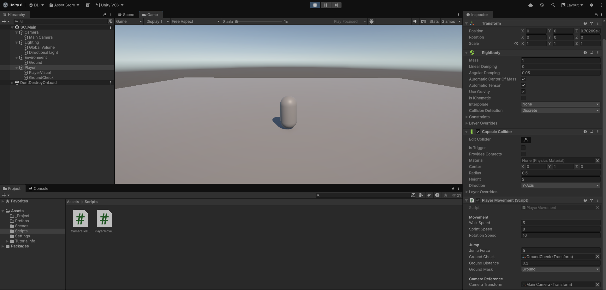
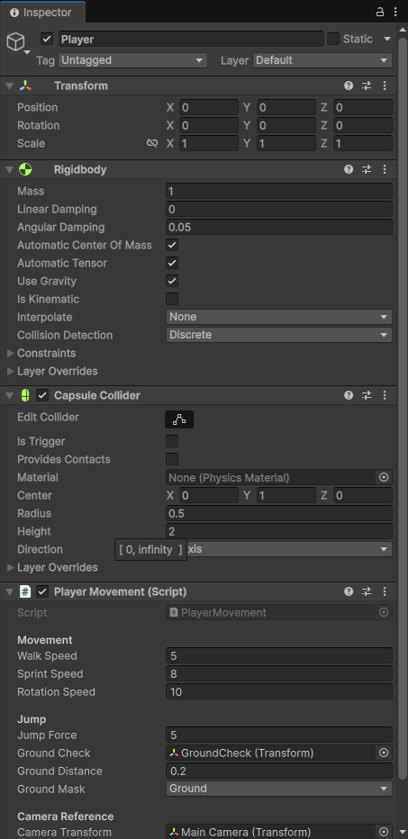
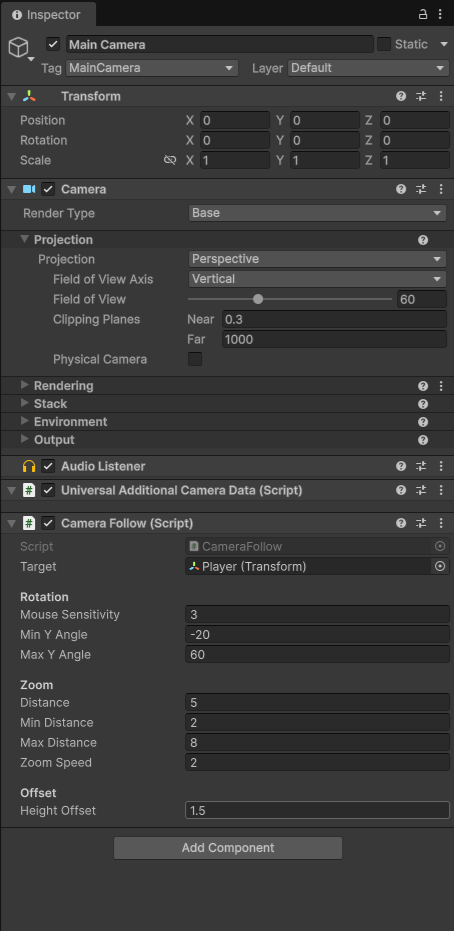

# 🎮 Unity Player Movement System (Third Person)

A clean and ready-to-use third-person player movement system built in Unity.  
Perfect for RPG, survival, and simulation games.

---

## 📸 Preview

### 🧱 Scene Setup

### 👤 Player Inspector

### 🎥 Camera System

---

## 🚀 Features

- ✅ WASD movement (camera-relative)
- ✅ Smooth player rotation
- ✅ Sprint system (Shift)
- ✅ Jump system (Space)
- ✅ Ground check detection
- ✅ Third-person camera follow
- ✅ Mouse rotation (X & Y axis)
- ✅ Zoom in/out (scroll wheel)

---

## ⚙️ Setup

1. Open project in Unity
2. Load scene: SC_Main
3. Press Play

---

## 🛠 Requirements

- Unity 6 (URP)
- Input System: Both or Old

---

## 💼 Use Case

- RPG games
- Survival games
- Simulation projects
- Any 3D prototype

---

## 📌 Notes

This is a clean base system designed for easy expansion and customization.
